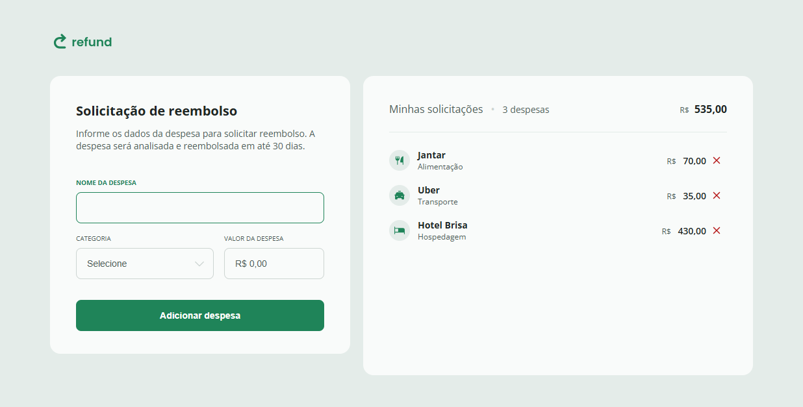

<h1 align="center">Refund</h1>

  

## Sobre o projeto 
Aplicação web desenvolvida para praticar e aprimorar conhecimentos em JavaScript, criando uma interface para solicitação e gerenciamento de despesas para reembolso.
O projeto permite cadastrar despesas informando nome, categoria e valor, visualizar as solicitações adicionadas, remover despesas e acompanhar automaticamente a quantidade de despesas e o valor total dos reembolsos.

## Funcionalidades 
- Cadastro de despesas
- Seleção de categoria da despesa
- Formatação automática dos valores em Real brasileiro (BRL)
-  Listagem das despesas cadastradas
-  Remoção de despesas
-  Contagem automática de despesas
-  Cálculo automático do valor total
  
## Objetivo 
- Manipulação do DOM
- Eventos e interações com o usuário
- Manipulação de dados
- Funções
- Formatação de valores monetários
- Criação e remoção dinâmica de elementos HTML

## Tecnologias 
- HTML: estrutura da aplicação
- CSS: estilo 
- JavaScrip: lógica e interatividade

## Como executar 
1. Clone o repositório: git clone https://github.com/raissaximenes/refund.git
2. Acesse a pasta:  repositório
3. Execute o projeto: Abra o arquivo index.html diretamente no navegador.

## Como utilizar 
- Informe o nome da despesa.
- Selecione uma categoria.
- Informe o valor da despesa.
- Clique em Adicionar despesa.
- A despesa será adicionada à lista.
- O número de despesas e o valor total serão atualizados automaticamente.
- Para excluir uma despesa, clique no ícone de remoção.
